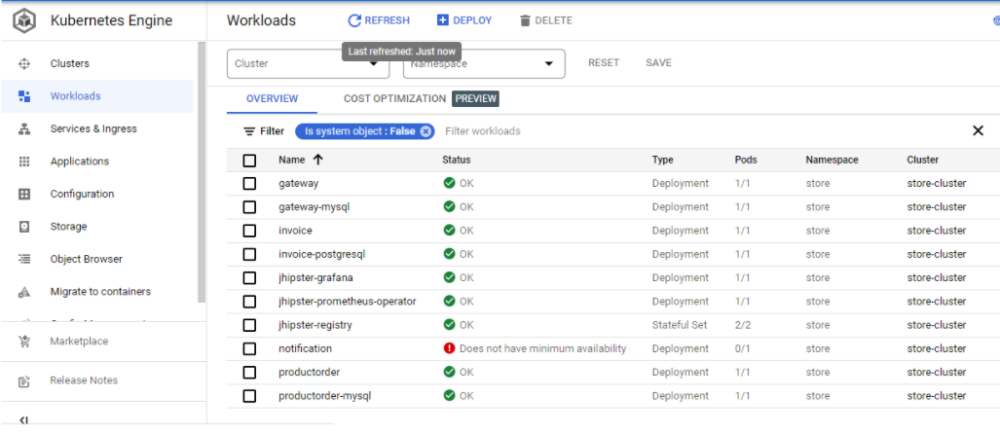
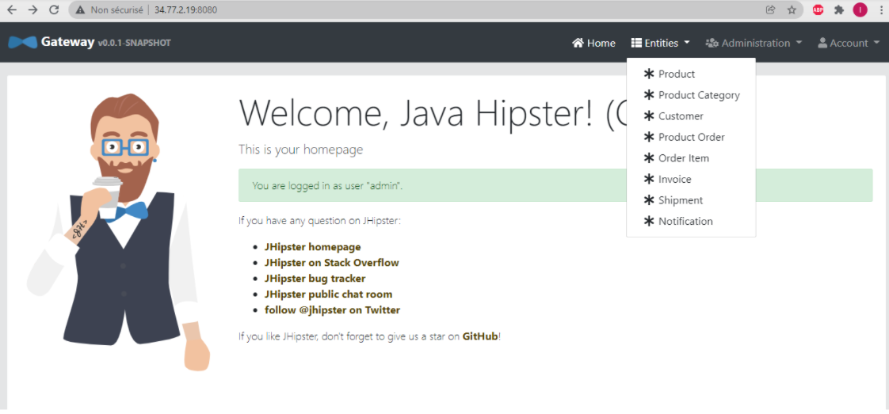

# microservices-online-store

<!-- TABLE OF CONTENTS -->

  
Table of Contents

  <ol>
    <li>
      <a href="#about-the-project">About The Project</a>
     
    </li>
    <li>
      <a href="#built-with">Built With</a>
    </li>
    <li><a href="#screenshots">Screenshots</a></li>
  </ol>

<!-- ABOUT THE PROJECT -->
## About The Project

This application is a basic app for an online store built in a microservices architecture, and then deployed in the Cloud.

## Built With

* [Jhiptser](https://www.jhipster.tech/) : a free and open-source application generator.
* [Google Cloud Plateform](https://cloud.google.com/) : the Cloud plateform where the app was deployed
* [Kubernetes](https://kubernetes.io/)
* [Gatling](https://gatling.io/) : a load injector used to test the autoscaling 

## Screenshots

    
  </a>

    
  </a>

